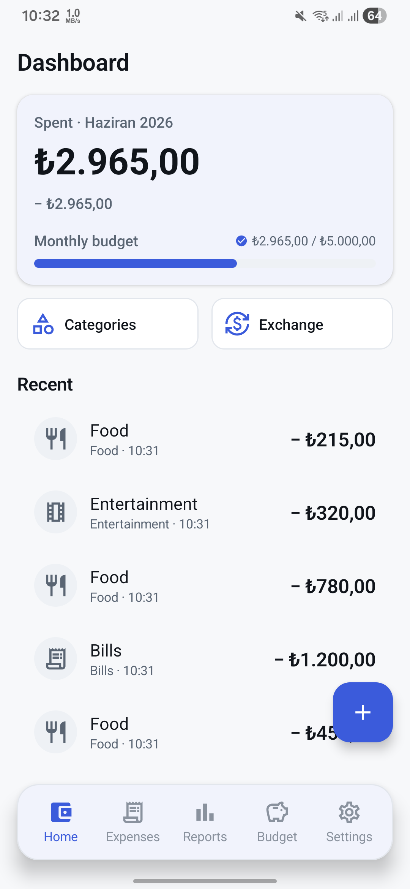
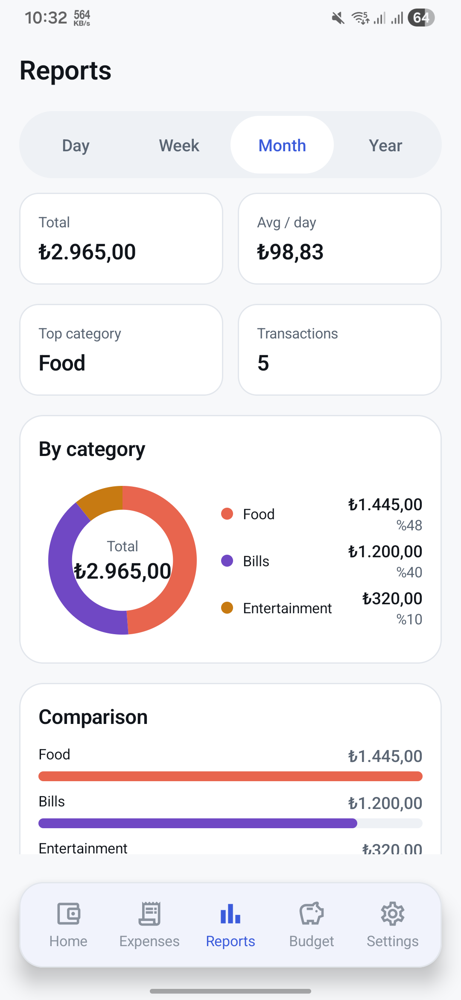
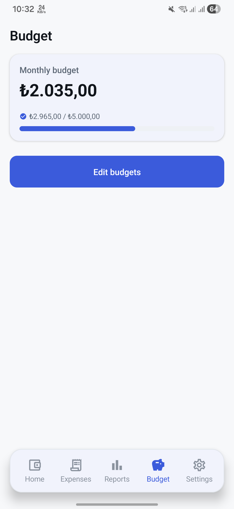
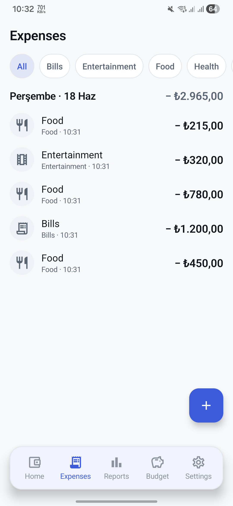
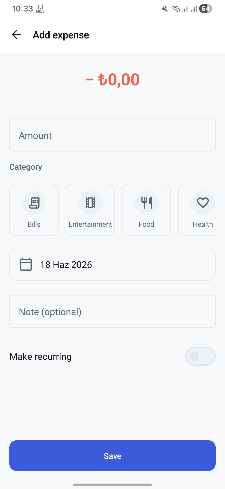
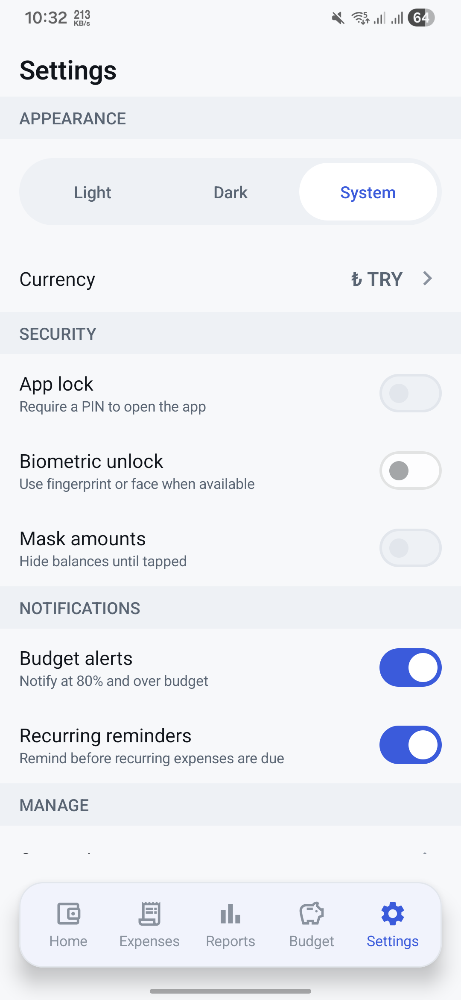
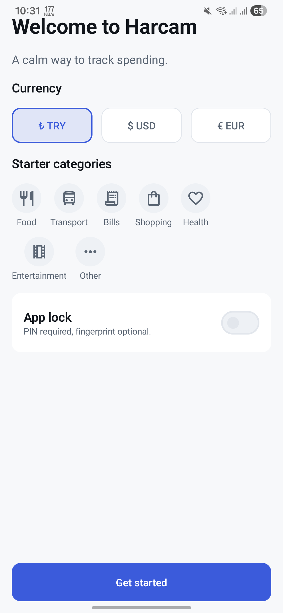

# 💸 Harcam — Personal Finance & Expense Tracker

A **native Android** personal-finance app built with **Jetpack Compose**, **Kotlin**, **MVVM + Clean Architecture**, **Coroutines & Flow**, **Room**, **Hilt**, **Retrofit**, and **WorkManager**.

Harcam is a local-first finance companion: log expenses, organize them by category, set monthly and per-category budgets with calm 80% / over-budget signaling, watch live exchange rates, track recurring payments, and read real reports — all behind an optional PIN / biometric lock. The design follows a documented **"Calm Money"** system so the UI reads like a real finance product, not a toy.

> Design language and architecture notes live in [`docs/README.md`](docs/README.md).

---

## 📱 Screenshots

<table>
  <tr>
    <td align="center"><br/><sub><b>Dashboard</b></sub></td>
    <td align="center"><br/><sub><b>Reports</b></sub></td>
    <td align="center"><br/><sub><b>Budget</b></sub></td>
    <td align="center"><br/><sub><b>Expenses</b></sub></td>
  </tr>
  <tr>
    <td align="center"><br/><sub><b>Add Expense</b></sub></td>
    <td align="center"><br/><sub><b>Settings</b></sub></td>
    <td align="center"><br/><sub><b>Onboarding</b></sub></td>
    <td></td>
  </tr>
</table>

---

## ✨ Features

- **Expenses** — add / edit / delete, day-grouped ledger, category filter chips, swipe-to-delete with Undo.
- **Categories** — color + icon coded, seeded defaults, per-category month-to-date spend, "move to Other" safe delete.
- **Budgets** — monthly + per-category limits with calm escalation: **NORMAL → WARNING (≥80%) → OVER (≥100%)**, always icon + text + numbers (never color alone).
- **Reports** — period tabs (Day/Week/Month/Year), stat cards (total / avg-per-day / top category / count), and Compose-native **donut / bar / trend** charts with accessible legends.
- **Exchange rates** — live TRY / USD / EUR via a REST API (**Retrofit**) behind a repository seam with a **Room cache fallback** and explicit *Live / Cached / Error* states.
- **Recurring** — subscriptions & regular bills with cadence + next-due; **WorkManager** materializes due occurrences into real expenses (idempotent) and reminds before budgets are crossed.
- **Security** — optional **PIN + biometric** app lock (EncryptedSharedPreferences + `androidx.biometric`), re-locks on resume; amount masking option.
- **Settings** — light / dark / system theme, currency, security & notification toggles, navigation shortcuts.

---

## 🎯 Job-spec signal map

This project was rebuilt to demonstrate a concrete Android skill set. Each requirement maps to real code:

| Requirement | Where it lives |
|---|---|
| **Jetpack Compose** | All UI in `presentation/**` + `core/ui/components` (custom charts, PinPad, finance components) |
| **Kotlin** | 100% Kotlin |
| **MVVM / Clean Architecture** | `core / data / domain / presentation / di` layering; repository seam |
| **Android fundamentals** | Single-activity, Navigation Compose, lifecycle-aware lock, notifications, permissions |
| **REST APIs + Retrofit** | `data/remote` (Retrofit + Moshi + OkHttp logging) → exchange-rate screen |
| **Coroutines & Flow** | `StateFlow` UiState, reactive Room `Flow`, `combine` / `flatMapLatest` / `stateIn(WhileSubscribed)` |
| **Dependency Injection (Hilt)** | `di/**` modules, `@HiltViewModel`, `@HiltWorker` factory |
| **Background work** | `WorkManager` workers (recurring materialization + budget reminders) |
| **Local persistence** | Room 2.6.1 with a real `1→2` migration; DataStore preferences |
| **UI / UX** | Documented "Calm Money" design system, four-state screens, accessibility (semantics, ≥48dp, reduced-motion), responsive ≥600dp |
| **Testing** | JUnit + Turbine + coroutines-test unit tests (UseCases, ViewModels, mappers) + Compose UI smoke tests |
| **Git** | Conventional history; docs-first workflow |
| **Fintech interest** | Budgets, categories, multi-currency, recurring payments, exchange rates |

---

## 🏗️ Architecture

**MVVM + Clean Architecture** with a repository seam — presentation and domain depend only on `domain` interfaces; `data` provides Room- and Retrofit-backed implementations.

```
com.mustafakara.harcam
├── core/            # ui (theme tokens, components), navigation, util, common (AppResult, Clock)
├── data/            # local (Room: entity/dao/database), remote (Retrofit api/dto), mapper, repository
├── domain/          # model, repository interfaces, usecase
├── presentation/    # per-feature: <feature>UiState + @HiltViewModel + Screen (Compose)
├── di/              # Hilt modules (Database, Network, Repository)
└── work/            # WorkManager workers + scheduler + notifications
```

**Key patterns**
- **State:** immutable `UiState` per screen, exposed as `StateFlow`, combined from Room `Flow`s in UseCases via `stateIn(WhileSubscribed(5s))`.
- **Error contract:** remote calls return a sealed `AppResult<T>` / `AppError`; `HttpException` / `IOException` never leak past `data`. The exchange Room cache is the offline fallback.
- **Theme:** Material 3 `ColorScheme` + an `AppColors` extension for finance tokens; **no raw hex in composables** — only semantic tokens.

See [`docs/README.md`](docs/README.md) for the design language, layer map, flows, and testing notes.

---

## 🧰 Tech stack

| Area | Tech | Version |
|---|---|---|
| Language | Kotlin | 1.9.20 |
| UI | Jetpack Compose (BOM) | 2023.10.01 · Material 3 |
| Architecture | MVVM + Clean Architecture | — |
| DI | Hilt | 2.48 |
| Persistence | Room | 2.6.1 |
| Preferences | DataStore | — |
| Networking | Retrofit + Moshi + OkHttp | — |
| Background | WorkManager + hilt-work | 2.9.0 |
| Security | security-crypto + biometric | — |
| Async / reactive | Coroutines + Flow / StateFlow | 1.7.3 |
| Navigation | Navigation Compose | 2.7.6 |
| Testing | JUnit · Turbine · coroutines-test · MockK · compose-ui-test | — |
| SDK | minSdk 24 · targetSdk / compileSdk 34 | — |

---

## 🚀 Build & run

```bash
# Build the debug APK
./gradlew :app:assembleDebug

# Run the unit test suite
./gradlew :app:testDebugUnitTest

# Run the Compose UI / instrumented tests (needs a device or emulator)
./gradlew :app:connectedDebugAndroidTest
```

Or open the project in Android Studio and run the `app` configuration. The exchange-rate base URL is provided via `BuildConfig.EXCHANGE_API_BASE_URL` (a free, key-less endpoint).

---

## 👨‍💻 Author

**Mustafa Kara**
- GitHub: [mustafa-kara](https://github.com/mustafa-kara)
- LinkedIn: [-mustafakara](https://linkedin.com/in/-mustafakara)
- Email: mustafakara.dev@gmail.com
