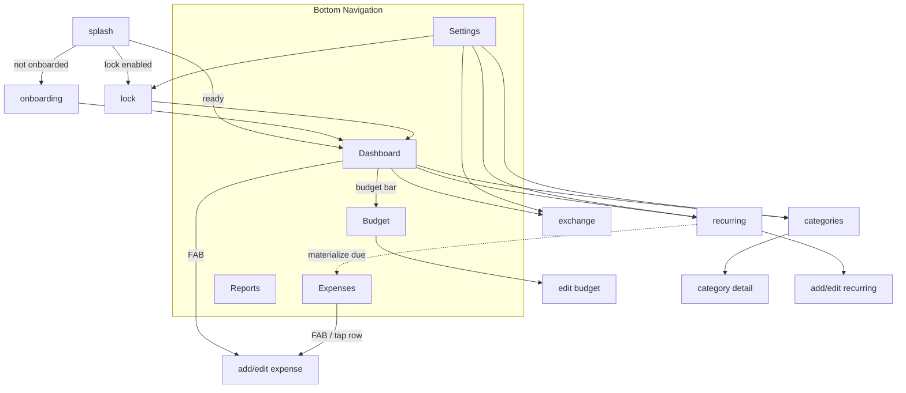

# HarcamApp — Design & Architecture Notes

> Native Android personal-finance app · Kotlin · Jetpack Compose · MVVM + Clean Architecture

These notes capture the design language and architecture the app is built on. For the running feature list, tech stack, and build instructions see the [root README](../README.md).

---

## Design language — "Calm Money"

Light-first, soft and trustworthy: airy neutral surfaces, friendly rounded shapes, color-coded categories, a single trust-indigo accent, and money values that never alarm or jump.

Reference products: **Wallet by BudgetBakers** (information architecture), **Spendee** (soft visual language & category color), **Money Manager** (report depth).

**Principles**
- **Trust:** amounts are exact, single-meaning, tabular (`tnum`) so digits never shift. Spending is shown plainly, not dramatically.
- **Two-color spend direction:** `expense` is a warm coral, `income` / `success` green. Alarm `danger` red is reserved for genuine problems (over-budget, destructive actions) — never the default for money.
- **Color is never the only channel:** budget state, spend direction, category and status always pair color with an icon + text/sign.

**Tokens (semantic — never raw hex in composables)**
- Color via Material 3 `ColorScheme` + an `AppColors` extension for finance tokens (expense / income / warning / danger / info + a fixed category palette), with a separately-tuned dark variant.
- Type: **Plus Jakarta Sans** (display / balances) + **IBM Plex Sans** (body / UI, tabular figures for money).
- 4-unit spacing scale, radius + motion tokens (fast 150 / base 200 / slow 300 ms), all defined in `core/ui/theme`.

**Standards every data screen follows**
- **Four states:** Loading (skeleton mirroring the success layout) · Success · Empty (screen-specific copy) · Error + Retry — mapped 1:1 to the `UiState`.
- **Accessibility:** ≥48 dp touch targets, 4.5:1 contrast, readable amount `semantics` labels, `liveRegion` for changing totals, reduced-motion support.
- **Responsive:** width-based via `BoxWithConstraints` — forms constrained and charts laid out side by side at ≥600 dp.

---

## Architecture — MVVM + Clean Architecture

```
com.mustafakara.harcam
├── core/            # ui (theme tokens, components), navigation, util, common (AppResult, Clock)
├── data/            # local (Room: entity/dao/database), remote (Retrofit api/dto), mapper, repository
├── domain/          # model, repository interfaces, usecase
├── presentation/    # per-feature: <feature>UiState + @HiltViewModel + Screen (Compose)
├── di/              # Hilt modules (Database, Network, Repository)
└── work/            # WorkManager workers + scheduler + notifications
```

- **Repository seam:** presentation and domain depend only on `domain` repository interfaces; `data` provides Room- and Retrofit-backed implementations. This keeps ViewModels testable with fakes and isolates the one remote dependency.
- **State:** immutable `UiState` per screen, exposed as `StateFlow`, combined from reactive Room `Flow`s in UseCases via `stateIn(WhileSubscribed(5s))`.
- **Error contract:** remote calls return a sealed `AppResult<T>` / `AppError`; `HttpException` / `IOException` never leak past `data`. The exchange-rate Room cache is the offline fallback.
- **Background:** `WorkManager` (Hilt-injected workers) — `RecurringWorker` materializes due recurring expenses idempotently; `BudgetReminderWorker` notifies at 80% / over budget.
- **Navigation:** a single Navigation Compose `NavHost` — 5 bottom-nav destinations (Dashboard · Expenses · Reports · Budget · Settings); auth (splash / onboarding / lock), categories, recurring and exchange sit outside the bottom bar.

---

## Screen flow



---

## Testing

- **Unit (JVM):** UseCases (validation, budget thresholds, period report, recurring materialization), ViewModels (Turbine + fake repositories), mappers and `MoneyFormatter`.
- **Compose:** smoke tests for the design-system building blocks (empty state, budget bar over-budget, button states).
